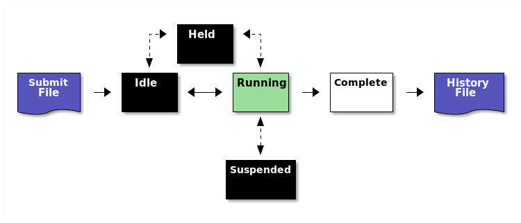
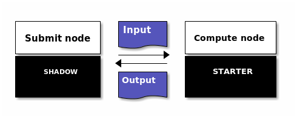

- [Lingo](#orgc7e7c64)
  - [Condor submit script](#org84eef01)
    - [Condor submit-script parameters/commands](#org16cdbb5)
    - [Python in Condor](#org7a47079)
  - [Condor DAGMan](#orgbe47a5e)
  - [Monitor your DAGs/runs/the cluster](#org73ea929)
  - [Cluster/node/cpu info](#org92ed407)
  - [OSG/HTCondor troubleshooting](#org5e07d1b)
    - [Condor structure](#orga9f8810)
    - [Possible issues](#org3a7a500)
    - [What are my jobs up to?](#orga443d0f)
    - [Why are my jobs idle?](#orgb4b338d)
    - [Why are my jobs still running?](#org5b4808f)
    - [Why are my jobs held?](#org92d0ac5)
    - [My jobs completed, but the output is wrong](#org6795aa0)
    - [Troubleshooting DAGs](#org96d8419)

-   <https://htcondor.readthedocs.io/en/latest/users-manual/>


<a id="orgc7e7c64"></a>

# Lingo

-   **Shadow :** submit node
-   **Starter:** compute node


<a id="org84eef01"></a>

# Condor submit script

-   <https://htcondor.readthedocs.io/en/latest/users-manual/submitting-a-job.html>

```bash
# job.sub -- submit a simple bash job
executable              = job.sh
log                     = job.log
output                  = job.out
error                   = job.err
should_transfer_files   = Yes
when_to_transfer_output = ON_EXIT

queue
```

-   submission: `condor_submit job.sub`


<a id="org16cdbb5"></a>

## Condor submit-script parameters/commands

-   **`universe`:** use vanilla?
-   **`executable`:** path/name of executable
-   **`arguments`:** cli options and arguments for executable
-   **`periodic_release`:** 

-   **`request_cpus`:** number of cpus needed
-   **`request_memory`:** amount of memory needed
-   **`want_graceful_removal`:** 

-   **`kill_sig`:** 

-   **`accounting_group`:** set for LIGO jobs
-   **`accounting_group_user`:** set for LIGO jobs
-   **`environment`:** set environment variables for job: e.g. `environment = "DIR=/path/to/dir"`
-   **`+SingularityImage`:** path to Singularity image (also acts as switch between using S. or not)
-   **`transfer_executable`:** transfer the executable from the local dir (`YES/NO`)
-   **`getenv`:** 

-   **`x509userproxy`:** path/name of the `x509_proxy` file
-   **`use_x509userproxy`:** `True` for LIGO
-   **`requirements`:** compute node CPU family, processor capabilities, availability of Singularity, &#x2026;
-   **`should_transfer_files`:** transfer input files to compute node and/or output files back to submit node
-   **`when_to_transfer_output`:** `ON_EXIT`, &#x2026;, `ON_SUCCESS` (latter from ~v8.9.7 onwards)
-   **`success_exit_code`:** 

-   **`preserve_relative_paths`:** >v8.8
-   **`transfer_input_files`:** comma-separated list of file names
-   **`transfer_output_files`:** comma-separated list of file names
-   **`transfer_output_remaps`:** doubly-quoted, semicolon-separated list of remaps(?)
-   **`output`:** file that should contain stdout
-   **`error`:** file that should contain stderr
-   **`notification`:** 


-   **`queue`:** queue command (ends the settings)?


<a id="org7a47079"></a>

## Python in Condor

-   **Duncan McL:** If you are running a python script in a condor job, (I recommend) you should always use as the executable either the **absolute path** of a python interpreter, or the **absolute path** of a python script that includes a shebang line that itself includes the **absolute path** of a python interpreter - anything else is just asking for environment troubles.


<a id="orgbe47a5e"></a>

# Condor DAGMan

-   <https://htcondor.readthedocs.io/en/latest/users-manual/dagman-workflows.html>
-   variables used in the Condor submit files `*.sub` are (probably) declared in the dagman `*.dag` files.
    -   `VARS title(?) var1="value1" var2="value2"`
    -   when using them in single `*.sub` files (e.g. for debugging) they translate to:
        
        ```conf
        var1=value1
        var2=value2
        ```
        
        (i.e. without the quotes, even if `valuei` contains spaces).


<a id="org73ea929"></a>

# Monitor your DAGs/runs/the cluster

-   <https://htcondor.readthedocs.io/en/latest/man-pages/condor_q.html>

```bash
condor_q  # Monitor your DAGs/jobs
condor_q -allusers  # All users
condor_q -analyze 846.0  # Details on job
condor_q -better 846.0  # More details on job - same as -better-analyze

condor_q -unmatchable  # List with some details on jobs that do not match any machines

condor_rm <job_id>  # Remove job or DAG <job_id>
condor_rm <user>    # Remove all <user>'s jobs
```

-   Note: if a DAG is removed, it may split up into a list of individual jobs for a number of seconds before disappearing.
-   set aliases cq, cqa, cqb, cqw, crm, &#x2026;


<a id="org92ed407"></a>

# Cluster/node/cpu info

```bash
condor_status  # What is each node doing?  (Claimed ~ Busy;  Unclaimed ~ Idle)
condor_status -total  # Just show totals  (see my script condor_status_totals)
condor_status -long   # Detailed info on ALL cpus
```


<a id="org5e07d1b"></a>

# OSG/HTCondor troubleshooting

-   Source: OSG user school 2017: <https://opensciencegrid.org/user-school-2017/materials/day2/files/osgus17-day2-part4-troubleshooting.pdf>


<a id="orga9f8810"></a>

## Condor structure




<a id="org3a7a500"></a>

## Possible issues

1.  `ERROR: Can't open "/cloud/login/blin/school/input_data" with flags 00 (No such file or directory)`
    -   no executable specified?
2.  `ERROR: I don't know about the 'vanila' universe`
    -   typo?
3.  `ERROR: Executable file /bin/slep does not exist`
    -   typo?
4.  Note: Errors appears in `*dagman.out` files instead of STDOUT or STDERR


<a id="orga443d0f"></a>

## What are my jobs up to?

```bash
condor_q -help status
```

Job status codes:

-   **I:** `IDLE`
-   **R:** `RUNNING`
-   **X:** `REMOVED`
-   **C:** `COMPLETED`
-   **H:** `HELD`
-   **>:** `TRANSFERRING_OUTPUT`
-   **S:** `SUSPENDED`


<a id="orgb4b338d"></a>

## Why are my jobs idle?

```bash
condor_q -better 29486
```

-   shows desired and (un)matched requirements


<a id="org5b4808f"></a>

## Why are my jobs still running?

-   Solution: Use `condor_ssh_to_job <job ID>` to open an SSH session to the worker node running your job.
    -   Non-OSG jobs only!


<a id="org92d0ac5"></a>

## Why are my jobs held?

```bash
condor_q -held
```

-   Condor couldn’t run your executable, e.g. because:
    1.  `Failed to execute '/path/to/executable': (errno=13: 'Permission denied')`
        -   no executable permission?
    2.  `Failed to execute '/path/to/executable': (errno=8: 'Exec format error')`
        -   no shebang?
        -   use absolute paths (also in shebang?)
    3.  `Failed to initialize user log to /path/to/test-000.log or /path/to/./test.dag.nodes.log`
        -   path does not exist or has no write permissions?
    4.  `Failed to execute '/cloud/login/blin/school/sleep.sh': invalid interpreter (/bin/bash) specified on first line of script (errno=2: 'No such file or directory')`
        -   There may be carriage returns (`^M`) in your executable (use dos2unix)
    5.  `Job has gone over memory limit of 1 megabytes. Peak usage: 1 megabytes`
        -   Request more resources:
            1.  Solution 1: Edit your jobs on the fly:
                
                ```bash
                condor_qedit <job ID> <resource> <value>  # e.g.:
                condor_qedit <job ID> RequestMemory <mem_in_MB>
                condor_qedit -const ‘JobStatus =?= 5’ RequestDisk <disk_in_KiB>
                condor_qedit -const ‘Owner =?= “blin”’ RequestCpus <CPUs>
                
                # Then:
                condor_release <job ID>
                ```
            2.  Solution 2: Remove job, fix submit file and resubmit job:
                
                ```bash
                condor_rm <job ID>  # Add request_disk, request_mem, or request_cpus to your submit file
                condor_submit <submit file>  
                ```
    6.  STARTER at `<address>` failed to send file(s) to `<address>`: error reading from `/var/lib/condor/execute/dir_xxx/bar`: (errno 2) No such file or directory; SHADOW failed to receive file(s) from `<128.104.100.52:10507>`
        
        -   ISSUE: Your job did not create the files that you specified in `transfer_output_files`.
        -   SOLUTION:
            1.  Check for typos in `transfer_output_files`, job runtime
            2.  add debugging information to your code
        -   Note:
        
        


<a id="org6795aa0"></a>

## My jobs completed, but the output is wrong

1.  Check `*.log` files for return codes or unexpected behavior: short runtimes, using too many or too few resources
2.  Check `*.err` and `*.out` for error messages.
3.  Submit an interactive job: `condor_submit -i <submit file>` and run the executable manually.
    1.  If it succeeds, does your submit file have the correct args? If yes, try adding `GET_ENV=True` to your submit file.
    2.  If it fails, there is an issue with your code or your invocation!


<a id="org96d8419"></a>

## Troubleshooting DAGs

1.  Check `*.rescue*` files (which DAG nodes failed)
2.  Check `*.dagman.out` (errors with job submission)
3.  Check `*.nodes.log` (return codes, PRE/POST script failures).
4.  If PRE/POST scripts failed, run them manually to see where they failed.
