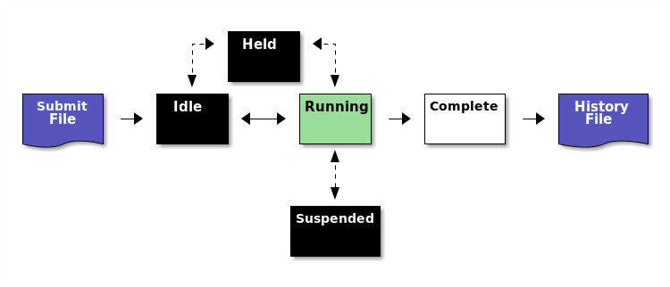
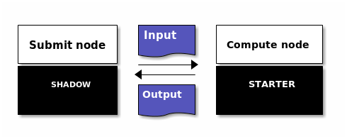

- [Condor structure](#org15d4884)
    - [Possible issues](#orgc20d153)
    - [What are my jobs up to?](#orgdfe62ef)
    - [Why are my jobs idle?](#org14c131c)
    - [Why are my jobs still running?](#org73d0d56)
    - [Why are my jobs held?](#orgc1ccbcf)
    - [My jobs completed, but the output is wrong](#org2f66441)
    - [Troubleshooting DAGs](#org2024c34)

-   Source: OSG user school 2017: <https://opensciencegrid.org/user-school-2017/materials/day2/files/osgus17-day2-part4-troubleshooting.pdf>


<a id="org15d4884"></a>

# Condor structure




<a id="orgc20d153"></a>

# Possible issues

1.  `ERROR: Can't open "/cloud/login/blin/school/input_data" with flags 00 (No such file or directory)`
    -   no executable specified?
2.  `ERROR: I don't know about the 'vanila' universe`
    -   typo?
3.  `ERROR: Executable file /bin/slep does not exist`
    -   typo?
4.  Note: Errors appears in `*dagman.out` files instead of STDOUT or STDERR


<a id="orgdfe62ef"></a>

# What are my jobs up to?

```bash
condor_q -help status
```

Job status codes:

-   **I:** `IDLE`
-   **R:** `RUNNING`
-   **X:** `REMOVED`
-   **C:** `COMPLETED`
-   **H:** `HELD`
-   **>:** `TRANSFERRING_OUTPUT`
-   **S:** `SUSPENDED`


<a id="org14c131c"></a>

# Why are my jobs idle?

```bash
condor_q -better 29486
```

-   shows desired and (un)matched requirements


<a id="org73d0d56"></a>

# Why are my jobs still running?

-   Solution: Use `condor_ssh_to_job <job ID>` to open an SSH session to the worker node running your job.
    -   Non-OSG jobs only!


<a id="orgc1ccbcf"></a>

# Why are my jobs held?

```bash
condor_q -held
```

-   Condor couldn’t run your executable, e.g. because:
    1.  `Failed to execute '/path/to/executable': (errno=13: 'Permission denied')`
        -   no executable permission?
    2.  `Failed to execute '/path/to/executable': (errno=8: 'Exec format error')`
        -   no shebang?
        -   use absolute paths (also in shebang?)
    3.  `Failed to initialize user log to /path/to/test-000.log or /path/to/./test.dag.nodes.log`
        -   path does not exist or has no write permissions?
    4.  `Failed to execute '/cloud/login/blin/school/sleep.sh': invalid interpreter (/bin/bash) specified on first line of script (errno=2: 'No such file or directory')`
        -   There may be carriage returns (`^M`) in your executable (use dos2unix)
    5.  `Job has gone over memory limit of 1 megabytes. Peak usage: 1 megabytes`
        -   Request more resources:
            1.  Solution 1: Edit your jobs on the fly:
                
                ```bash
                condor_qedit <job ID> <resource> <value>  # e.g.:
                condor_qedit <job ID> RequestMemory <mem_in_MB>
                condor_qedit -const ‘JobStatus =?= 5’ RequestDisk <disk_in_KiB>
                condor_qedit -const ‘Owner =?= “blin”’ RequestCpus <CPUs>
                
                # Then:
                condor_release <job ID>
                ```
            2.  Solution 2: Remove job, fix submit file and resubmit job:
                
                ```bash
                condor_rm <job ID>  # Add request_disk, request_mem, or request_cpus to your submit file
                condor_submit <submit file>  
                ```
    6.  ~STARTER at <address> failed to send file(s) to <address>: error reading from /var/lib/condor/execute/dir<sub>xxx</sub>/bar: (errno 2) No such file or directory; SHADOW failed to receive file(s) from <128.104.100.52:10507>~
        
        -   ISSUE: Your job did not create the files that you specified in transfer<sub>output</sub><sub>files</sub>.
        -   SOLUTION:
            1.  Check for typos in transfer<sub>output</sub><sub>files</sub>, job runtime
            2.  add debugging information to your code
        -   Note:
        
        


<a id="org2f66441"></a>

# My jobs completed, but the output is wrong

1.  Check `*.log` files for return codes or unexpected behavior: short runtimes, using too much or too few resources
2.  Check `*.err` and `*.out` for error messages.
3.  Submit an interactive job: `condor_submit -i <submit file>` and run the executable manually.
    1.  If it succeeds, does your submit file have the correct args? If yes, try adding `GET_ENV=True` to your submit file.
    2.  If it fails, there is an issue with your code or your invocation!


<a id="org2024c34"></a>

# Troubleshooting DAGs

1.  Check `*.rescue*` files (which DAG nodes failed)
2.  Check `*.dagman.out` (errors with job submission)
3.  Check `*.nodes.log` (return codes, PRE/POST script failures).
4.  If PRE/POST scripts failed, run them manually to see where they failed.
